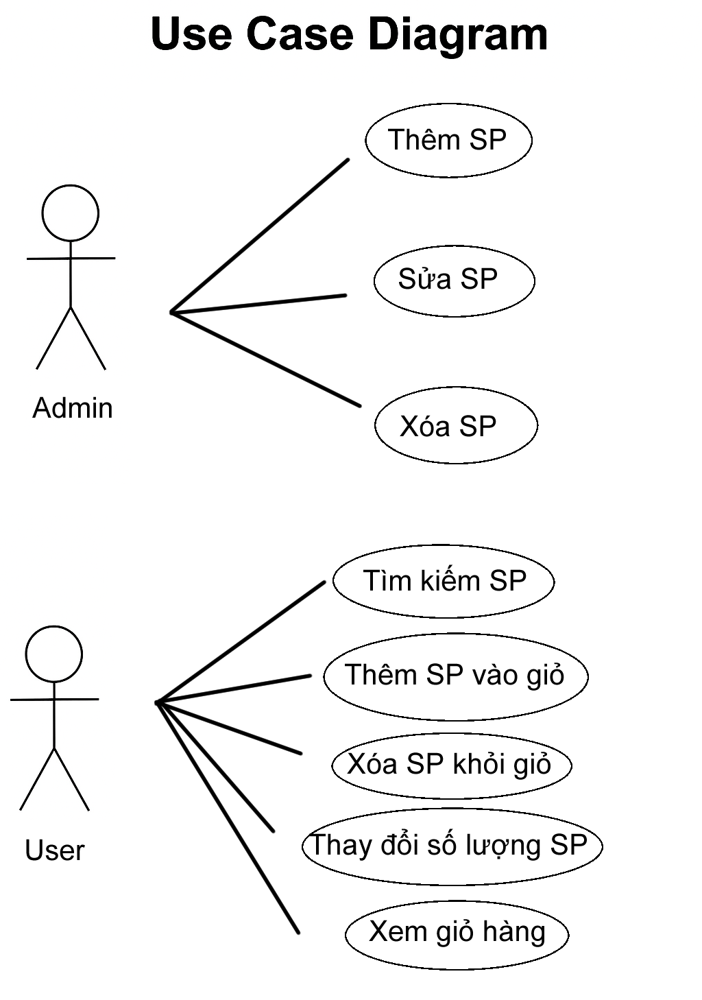
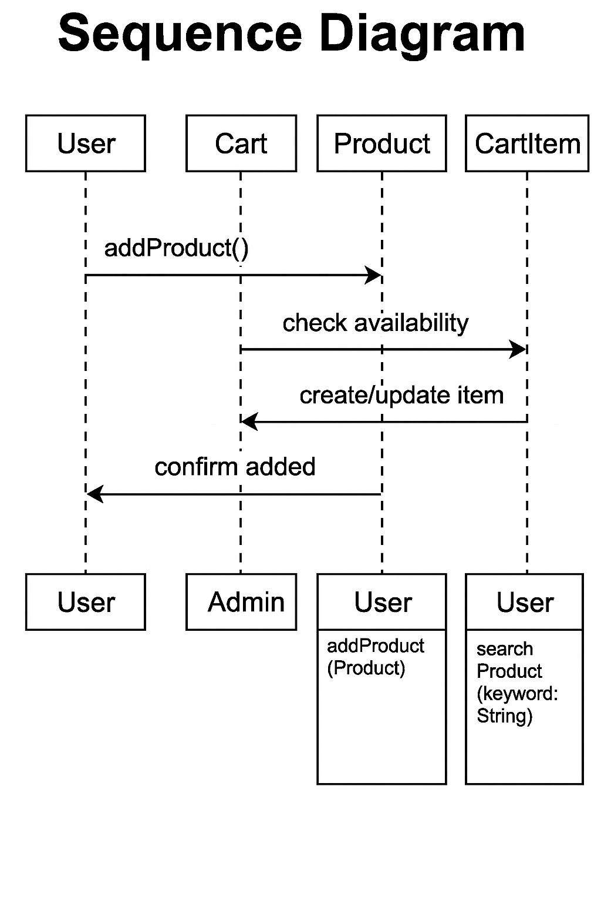
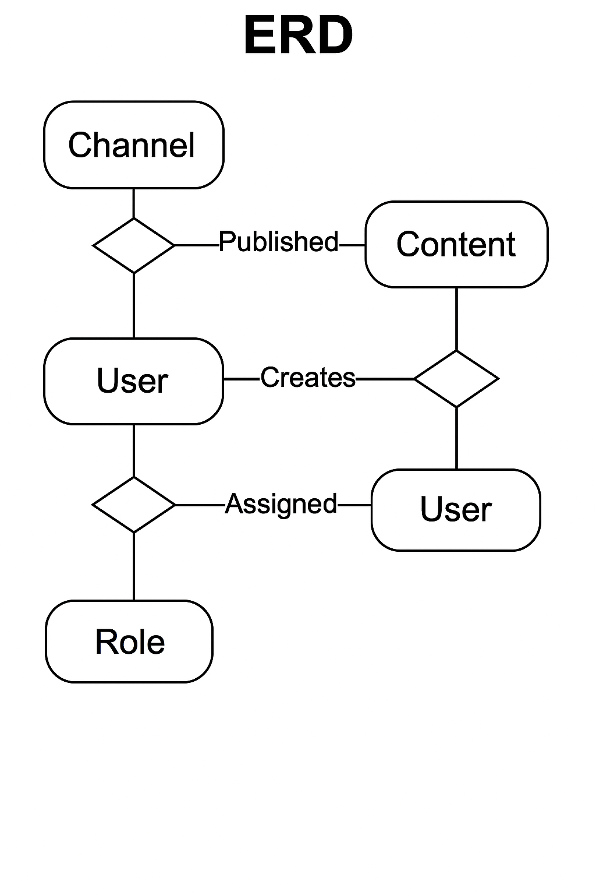

#  Software Engineering Project – Mini project (Hệ thống Hub media bán lẻ đa kênh cho điện máy)

---

##  Giới thiệu
Đây là đồ án môn học Nhập môn công nghệ phần mềm. Đề tài hướng đến xây dựng hệ thống Web App truyền thông đa phương tiện cho doanh nghiệp điện máy, hỗ trợ quản trị nội dung số và xuất bản đa kênh.

---

##  Thành viên nhóm
- Vũ Ngọc Quỳnh Thy - Leader 
- Đỗ Như Ý
- Đỗ Xuân Đức

---

##  Mục tiêu
- Phát triển Web App truyền thông đa phương tiện cho doanh nghiệp 
- Quản trị nội dung số, xuất bản đa kênh (Web/FB/Zalo/TikTok/YouTube) 
- Hỗ trợ livestream/clip ngắn
- Tối ưu SEO/Analytics
- Áp dụng SDLC (Waterfall/Agile-Scrum)
---

##  Nội dung
- Quy trình duyệt nội dung (workflow) 
- Lịch nội dung 90 ngày
- Công cụ tạo poster/thumbnail
- PWA offline
- Thông báo đẩy
- SEO (sitemap/OG/Schema)
- Kiểm thử unit/integration/E2E

---

##  Thiết kế hệ thống
- Use Case chính  
- Quản lý nội dung  
- Quản lý người dùng  
- Quản lý phân quyền và tuân thủ

---

##  Các sơ đồ thiết kế
### Use Case Diagram

###  Sơ đồ Sequence Diagram

### ERD (Entity Relationship Diagram)

---

##  Công nghệ sử dụng
- Ngôn ngữ lập trình: Java / JavaScript / PHP / HTML  
- IDE: Visual Studio Code  
- Cơ sở dữ liệu: MySQL  
- Quản lý phiên bản: Git  
- Phương pháp phát triển: Agile – Scrum

---

##  Cài đặt và chạy thử
- Clone repo: https://github.com/thanhnhanthuyngoc-boop/Software-Engineering-Project-git